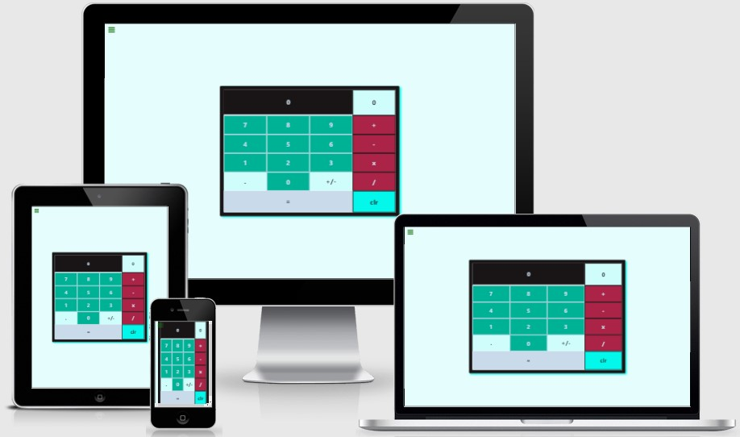

# Product Landing Page

This is a freeCodeCamp JavaScript Calculator Project.

The overall aim was to acheive a Personal Portfolio Webpage, this was only focusing on using HTML, CSS, SASS and JavaScript to help me develop my front end skills further!

## Showcase

 

A deployed version of my website can be found [here](https://elliej87.github.io/PersonalPortfolioWebpage/)

This domain will allow you to access the Tribute Page website.

## Table of Contents

1. [User Experience UX](#userexperienceuX)

    * [User Stories](#userstories)

        - [User Story #1](#userstory_1)
        - [User Story #2](#userstory_2)
        - [User Story #3](#userstory_3)
        - [User Story #4](#userstory_4)
        - [User Story #5](#userstory_5)
        - [User Story #6](#userstory_6)
        - [User Story #7](#userstory_7)
        - [User Story #8](#userstory_8)
        - [User Story #9](#userstory_9)
        - [User Story #10](#userstory_10)
        - [User Story #11](#userstory_11)
        - [User Story #12](#userstory_12)
        - [User Story #13](#userstory_13)
        - [User Story #14](#userstory_14)
        - [User Story #15](#userstory_15)
        - [Site Owner Goals](#sitegoals)

2. [Wireframes](#wireframesboards)

3. [Features](#featuressite)

    * [Main Container](#maincontainer)

4. [Technologies Used](#technologies)

    * [Version Control](#versioncontrol)

5. [Functionality Testing](#functionalitytesting)

6. [Responsive Design Testing](#responsivedesigntesting)

7. [Validation](#validationcode)
    - [HTML](#htmlcode)
    - [CSS](#csscode) 

8. [Deployment](#deploymentsite)

    * [Repository Link](#repositorylink)
    * [Running Code Locally](#runningcodelocally)

9. [Credits](#finalcredits)

    * [Content](#contentsite)
    * [Acknowledgments](#acknowledgmentsthanks)

## <a name="userexperienceuX">UX (User Experience)</a>

This website was to help practice my JavaScript SASS, HTML and CSS skills.

## <a name="userstories">User Stories</a>

### <a name="userstory_1">User Story #1</a>

- My calculator should contain a clickable element containing an = (equal sign) with a corresponding id="equals"

### <a name="userstory_2">User Story #2</a>

- My calculator should contain 10 clickable elements containing one number each from 0-9, with the following corresponding IDs: id="zero", id="one", id="two", id="three", id="four", id="five", id="six", id="seven", id="eight", and id="nine"

### <a name="userstory_3">User Story #3</a>

- My calculator should contain 4 clickable elements each containing one of the 4 primary mathematical operators with the following corresponding IDs: id="add", id="subtract", id="multiply", id="divide"

### <a name="userstory_4">User Story #4</a>

- My calculator should contain a clickable element containing a . (decimal point) symbol with a corresponding id="decimal"

### <a name="userstory_5">User Story #5</a>

- My calculator should contain a clickable element with an id="clear"

### <a name="userstory_6">User Story #6</a>

- My calculator should contain an element to display values with a corresponding id="display"

### <a name="userstory_7">User Story #7</a>

- At any time, pressing the clear button clears the input and output values, and returns the calculator to its initialized state; 0 should be shown in the element with the id of display

### <a name="userstory_8">User Story #8</a>

- As I input numbers, I should be able to see my input in the element with the id of display

### <a name="userstory_9">User Story #9</a>

- In any order, I should be able to add, subtract, multiply and divide a chain of numbers of any length, and when I hit =, the correct result should be shown in the element with the id of display

### <a name="userstory_10">User Story #10</a>

- When inputting numbers, my calculator should not allow a number to begin with multiple zeros

### <a name="userstory_11">User Story #11</a>

- When the decimal element is clicked, a . should append to the currently displayed value; two . in one number should not be accepted

### <a name="userstory_12">User Story #12</a>

-  I should be able to perform any operation (+, -, *, /) on numbers containing decimal points

### <a name="userstory_13">User Story #13</a>

- If 2 or more operators are entered consecutively, the operation performed should be the last operator entered (excluding the negative (-) sign). For example, if 5 + * 7 = is entered, the result should be 35 (i.e. 5 * 7); if 5 * - 5 = is entered, the result should be -25 (i.e. 5 * (-5))

### <a name="userstory_14">User Story #14</a>

- Pressing an operator immediately following = should start a new calculation that operates on the result of the previous evaluation

### <a name="userstory_15">User Story #15</a>

- My calculator should have several decimal places of precision when it comes to rounding (note that there is no exact standard, but you should be able to handle calculations like 2 / 7 with reasonable precision to at least 4 decimal places)

### <a name="sitegoals">Site Owner Goals</a>

- As a site owner I wanted to create and build a calculator using javaScript, HTML and styling with scss.

## <a name="wireframesboards">Wireframes</a>

As this was a brief project no wireframes were designed prior to building this site.

## <a name="featuressite">Features</a>

This section is a brief highlight of features that this site contains.

### <a name="maincontainer">Main Container</a>

- The main body is vertically and horizontally centered in the view port width
- When buttons are pressed these are displayed on the main view point

## <a name="technologies">Technologies Used</a>

[Bootstrap](https://getbootstrap.com)

- The project uses the Bootstrap framework to add a responsive grid system, prebuilt components, plugins built on jQuery, and Bootstrap styles to my site, before adding my own custom styling 

[CSS](https://en.wikipedia.org/wiki/CSS)

- The project uses CSS to apply the custom styles to create the look of my site.  The index.html file is linked directly to the main.css stylesheet

[Font Awesome](https://fontawesome.com/v4.7/) 

- The project uses Font Awesome icons for all navigation and social media links that feature in the header and footer of my site

Google Chrome Dev Tools

- For testing purposes for responsive design

[HTML5](https://en.wikipedia.org/wiki/HTML5)

- The project uses HTML to create the basic elements and content of my site 

[JavaScript](https://en.wikipedia.org/wiki/JavaScript)

- The project also uses JavaScript from Bootstrap which is required to add functionality to the Bootstrap as well as additional JavaScript to help with the logic for the calculator.

[jQuery](https://en.wikipedia.org/wiki/JQuery)

- The project uses jQuery to simplify DOM manipulation. This is both the standard jQuery that is built with Bootstrap components

[SASS](https://en.wikipedia.org/wiki/Sass_(stylesheet_language))

- The project uses SASS to apply the custom styles to create the look of my site.  The index.html file is linked directly to the main.css stylesheet

[Visual Studio Code](https://code.visualstudio.com)

- I used Visual Studio Code as the development environment to write the code for my website

### <a name="versioncontrol">Version Control</a>

[Git](https://git-scm.com)

- I've used Git as a version control system to regularly add and commit changes made to project in Visual Studio Code, before pushing them to GitHub.

[GitHub](https://github.com)

- I've used GitHub as a remote repository to push and store the committed changes to my project from Git. I've also used GitHub pages to deploy my website in a live environment.

## <a name="testingcases">Testing</a>

# <a name="functionalitytesting">Functionality Testing</a>

Browsers tested: Google Chrome, Mozilla Firefox & Opera.
The devices used in this testing include Samsung S10 v.Android 10.

## <a name="validationcode">Validation</a>

### <a name="htmlcode">HTML</a>

W3C testing completed for: index.html
No issues were stated.
 
## <a name="csscode">CSS</a>

W3C testing completed for: styles.css
No issues were stated.

## <a name="deploymentsite">Deployment</a>

The hosting platform that I've used for my project is GitHub Pages. To deploy my website to GitHub pages, I used the following steps:

- Loaded the terminal window in my visual studio code workspace
- Initialised Git using the Source Control in the control panel
- Files that have been amended are automatically listed in the ‘Source Control’ panel
- Add message in the ‘Message’ section, making sure the commits are clear and concise (re-checked previous commits for layout and what was fixed / still pending)
- Click the ‘tick’ icon which stored the files in visual studio code
- Click the ‘ellipsis’ icon and select the ‘push’ option
- This then push all files and commits to the main branch
- This will add the updated files into the ‘main branch’ option under the ‘GitHub pages’ section
- Ran several commits after testing was carried out throughout my project.

### <a name="repositorylink">Repository Link</a>

[JavaScript Calculator](https://elliej87.github.io/PersonalPortfolioWebpage/)

### <a name="runningcodelocally">Running Code Locally</a>

To run my code locally, users can download a local copy of my code to their desktop by completing the following steps:

-	Go to my GitHub repository.
-	Click on 'Clone or download'.
-	Click on 'Download ZIP'.
-	Once downloaded, extract the zip file's contents and run my website locally.

## <a name="contentsite">Content</a>

This website was a quick and fun site for me to practice more web development skills and styling .

## <a name="acknowledgmentsthanks">Acknowledgments</a>

_**Created by Ellie Judge**_
